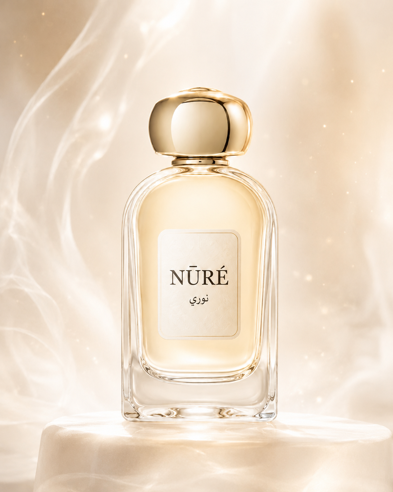

# NŪRÉ — نوري

A fictional luxury Arabic fragrance experience exploring modern oriental perfumery through light, glass, motion, and editorial product storytelling.

[View the live experience](https://nure-nu.vercel.app/)

<p align="center">
  
</p>

## Overview

NŪRÉ is a portfolio concept for a contemporary Arabic perfume maison.

The project combines luxury brand direction with a polished frontend experience: an atmospheric homepage, a six-fragrance collection, detailed product stories, scent pyramids, related recommendations, and an interactive Scent Finder.

The brand is fictional. Product names, fragrance descriptions, and collection details were created specifically for this design and frontend case study.

## Highlights

- Editorial luxury homepage with Arabic and English brand details
- Responsive fragrance collection with six fictional products
- Statically generated product-detail pages
- Product stories, moods, occasions, intensity, longevity, and scent pyramids
- Five-step Scent Finder with weighted deterministic recommendations
- Custom reveal, stagger, tilt, shimmer, mist, particle, and pointer-parallax effects
- Responsive navigation and mobile menu
- Product-specific metadata for search and social sharing
- Related-fragrance recommendations
- Reusable product, motion, navigation, and content components
- No backend, database, authentication, or external API required

## Experience

### Brand homepage

The homepage introduces the NŪRÉ visual world through:

- A cinematic hero composition
- Featured fragrances
- Scent-family storytelling
- Ritual and maison sections
- Noor Elixir signature spotlight
- Scent Finder entry point
- Layered product imagery and atmospheric motion

### Fragrance collection

The collection presents six fictional signatures:

- White Oud
- Solar Musk
- Saffron Veil
- Pearl Amber
- Desert Bloom
- Noor Elixir

Each product is driven by typed local data and includes:

- Fragrance family
- Concentration and size
- Short and long-form story
- Mood and occasion
- Intensity and longevity
- Top, heart, and base notes
- Related products
- Product-specific visual treatment

### Product pages

Product-detail routes are generated from the local collection data.

Each page includes:

- Product hero and artwork
- Fragrance profile
- Mood, occasion, and intensity
- Scent pyramid
- Product story
- Suggested wearing ritual
- Related fragrances
- Dynamic Open Graph and Twitter metadata

### Scent Finder

The Scent Finder guides visitors through five questions covering:

1. Mood
2. Occasion
3. Scent direction
4. Presence
5. Texture

Each answer contributes weighted scores to the collection. The final result recommends the strongest match and presents alternative fragrances.

The recommendation logic is deterministic and runs entirely in the browser—no AI service or external API is used.

## Routes

| Route | Purpose |
|---|---|
| `/` | Brand homepage and collection introduction |
| `/collection` | Full fragrance collection |
| `/collection/[slug]` | Statically generated product details |
| `/scent-finder` | Interactive fragrance recommendation quiz |

## Tech stack

- **Next.js 15** — App Router, metadata, static generation, and routing
- **React 19** — component architecture and interactive state
- **TypeScript 5** — typed products, props, and content models
- **Tailwind CSS 3** — responsive layout and design utilities
- **CSS** — custom visual effects, transitions, and animation system
- **Vercel** — deployment and hosting

## Frontend architecture

### Static content model

All fragrance and navigation content is defined in:

```text
lib/data.ts
```

The typed product model acts as the source of truth for:

- Collection cards
- Product-detail pages
- Scent Finder scoring
- Related products
- Metadata
- Fragrance notes and supporting copy

This keeps the experience easy to extend without introducing a CMS or database.

### Static product generation

Dynamic product pages use `generateStaticParams` to create a page for every fragrance at build time.

Product-specific metadata is generated from the same typed content model, including titles, descriptions, and social-preview images.

### Custom interaction system

The project uses lightweight React and CSS rather than a third-party motion library.

The reusable motion layer includes:

- Intersection Observer reveal effects
- Staggered entrance animations
- Pointer-based hero parallax
- Product-card tilt and glow
- Floating particle fields
- Shimmer overlays
- Perfume spray and mist effects
- Contextual scent-family accents

### Component structure

Shared components separate product presentation, motion behavior, navigation, and fragrance content.

Examples include:

- `ProductCard`
- `ProductHero`
- `ProductVisual`
- `ScentPyramid`
- `RelatedProducts`
- `ScentFinder`
- `PremiumMotion`
- `Navbar`
- `Footer`

## Local setup

### Prerequisites

- Node.js 20 or newer
- npm

### 1. Clone the repository

```bash
git clone https://github.com/abdelazizBi/nure.git
cd nure
```

### 2. Install dependencies

```bash
npm install
```

### 3. Configure the site URL

The project works locally without environment variables.

For correct absolute metadata URLs in a deployed environment, create `.env.local` and add:

```env
NEXT_PUBLIC_SITE_URL=http://localhost:3000
```

For production, replace the value with the deployed domain:

```env
NEXT_PUBLIC_SITE_URL=https://nure-nu.vercel.app
```

### 4. Start the development server

```bash
npm run dev
```

Open:

```text
http://localhost:3000
```

## Available commands

| Command | Description |
|---|---|
| `npm run dev` | Start the Next.js development server |
| `npm run build` | Create a production build |
| `npm run start` | Start the production server |
| `npm run lint` | Run TypeScript validation with `tsc --noEmit` |

## Production checks

Before deploying changes:

```bash
npm run lint
npm run build
```

## Deployment

The project is designed for Vercel.

1. Import the repository into Vercel.
2. Add `NEXT_PUBLIC_SITE_URL` with the production domain.
3. Deploy.

No database, storage service, API key, or server configuration is required.

## Project structure

```text
app/
├── collection/
│   ├── [slug]/
│   │   └── page.tsx        # Statically generated fragrance details
│   └── page.tsx            # Full collection
├── scent-finder/
│   └── page.tsx            # Recommendation experience
├── globals.css             # Design system and custom motion
├── layout.tsx              # Global metadata and root layout
└── page.tsx                # Brand homepage

components/
├── Button.tsx
├── Footer.tsx
├── Navbar.tsx
├── NoteChips.tsx
├── PremiumMotion.tsx       # Reusable motion and interaction layer
├── ProductCard.tsx
├── ProductHero.tsx
├── ProductVisual.tsx
├── RelatedProducts.tsx
├── ScentFinder.tsx
└── ScentPyramid.tsx

lib/
└── data.ts                 # Typed fragrance and brand content

public/
└── images/
    └── nure/               # Brand and fragrance imagery
```

## Design direction

NŪRÉ blends contemporary luxury presentation with references to Arabic fragrance traditions.

The visual system is built around:

- Pearl white and warm ivory
- Champagne gold
- Soft rose and sand
- Transparent glass
- Mist, light, and reflection
- English and Arabic details
- Restrained editorial typography
- Atmospheric rather than transactional product presentation

## Accessibility and responsive behavior

The interface includes:

- Semantic links and navigation
- Visible keyboard focus treatments
- Descriptive image alternative text
- Responsive layouts across desktop and mobile
- Mobile navigation
- Large interactive targets
- Clear page and product metadata

## Known limitations

- NŪRÉ is a fictional portfolio concept, not a commercial fragrance brand.
- Product data is stored locally rather than managed through a CMS.
- The newsletter form is presentational and does not submit data.
- There is no cart, checkout, account system, inventory, or backend.
- The Scent Finder is a deterministic recommendation experience, not an AI model.
- Some fragrances intentionally reuse the master bottle artwork when a dedicated product render is unavailable.
- The motion system currently relies on browser animation and pointer capabilities.

## Author

Built by **Abdelaziz Biad**, Senior Full-Stack Engineer.

- [Portfolio](https://ab-portfolio-ten.vercel.app/)
- [LinkedIn](https://www.linkedin.com/in/abdelaziz-biad/)
- [GitHub](https://github.com/abdelazizBi)